# 3proxy Admin UI

A comprehensive web-based administration interface for managing [3proxy](https://github.com/3proxy/3proxy) proxy servers. Built with Next.js, React, and TypeScript, this UI provides intuitive controls for user management, traffic monitoring, configuration, and system observability.

## Screenshots

### MacBook Pro 14" (3024×1964)

| Home | Login | Dashboard |
|:---:|:---:|:---:|
| 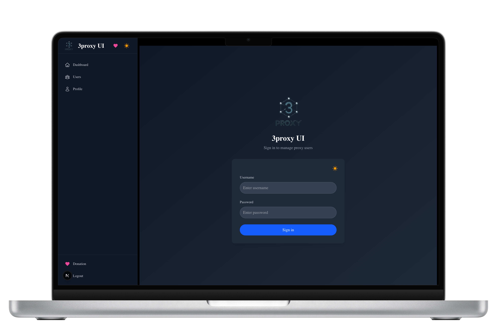 |  | 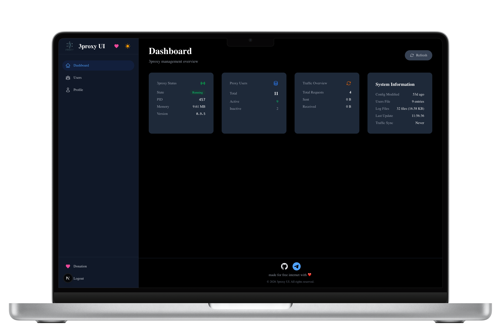 |

| Users List | Create User | Profile |
|:---:|:---:|:---:|
| 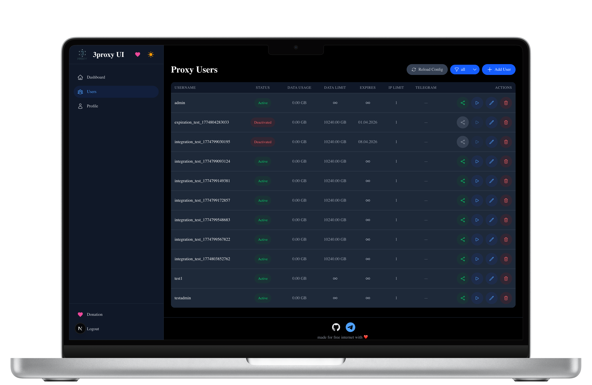 | 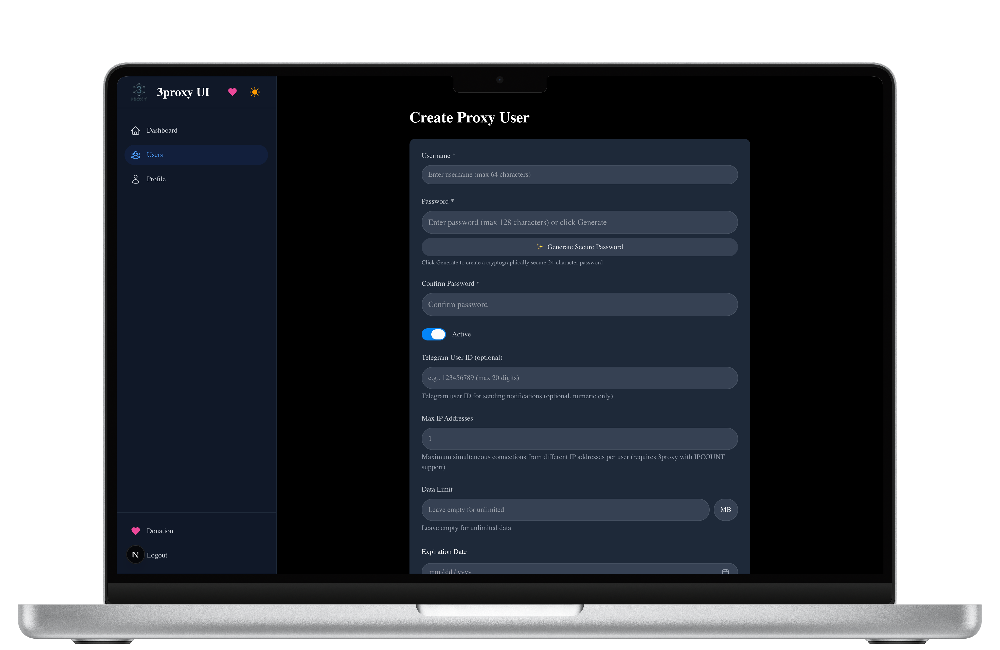 | 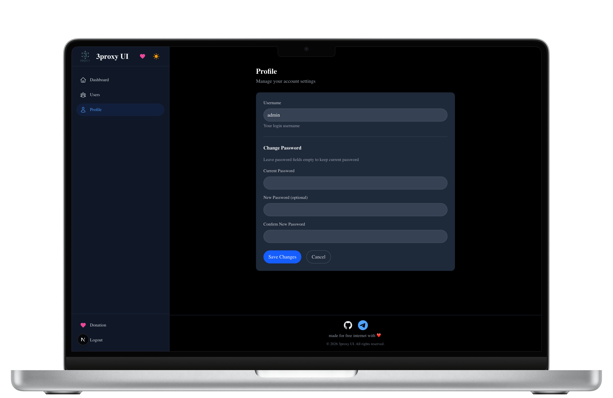 |

### iPad Pro 11" Portrait (1668×2388)

| Home | Login | Dashboard |
|:---:|:---:|:---:|
| 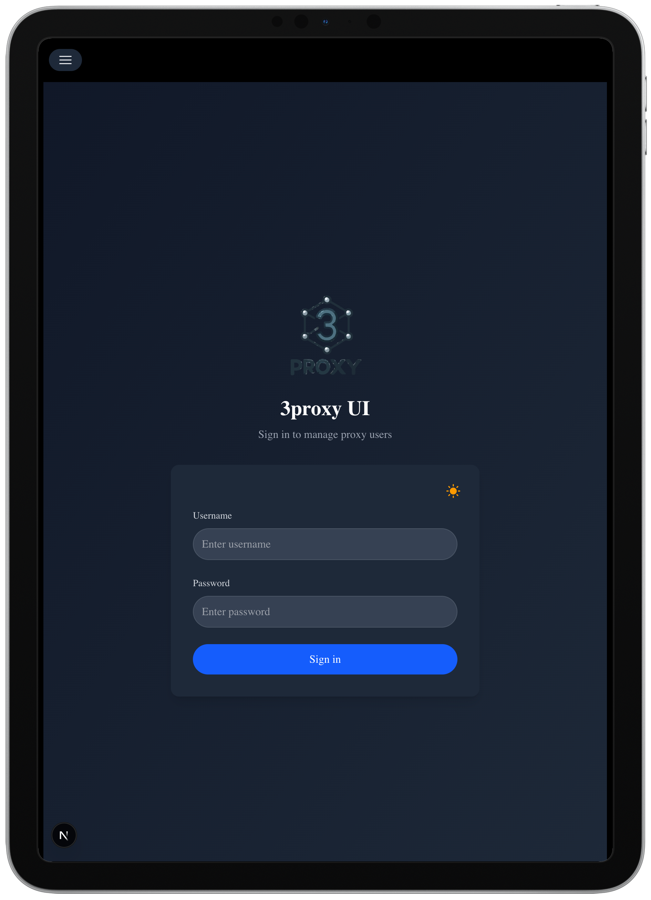 |  | 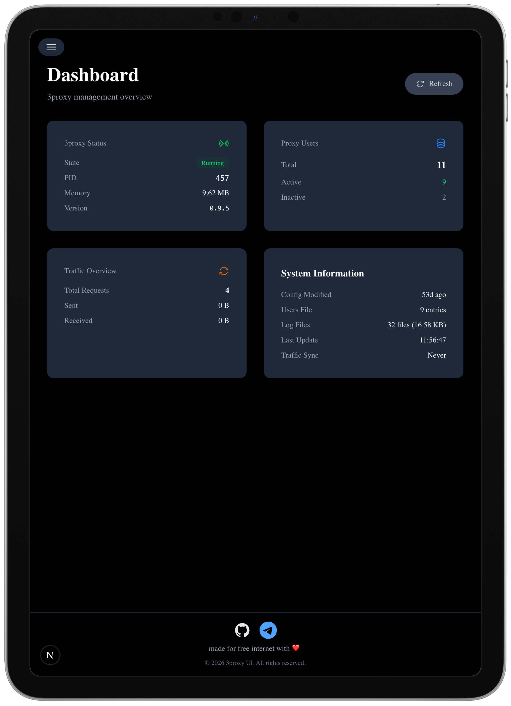 |

| Users List | Create User | Profile |
|:---:|:---:|:---:|
| 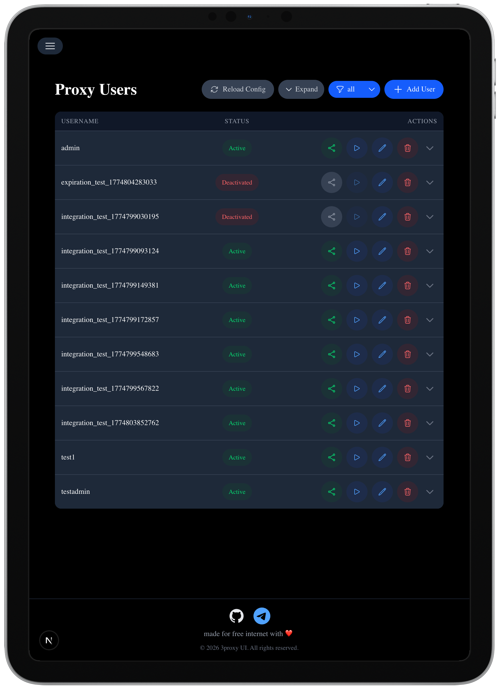 | 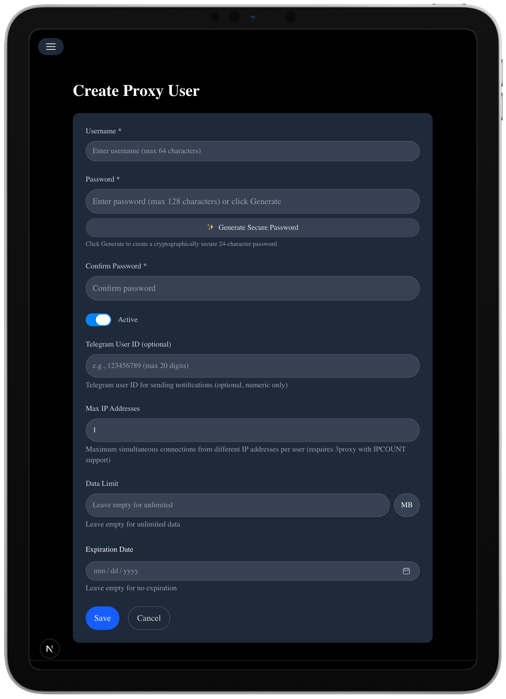 | 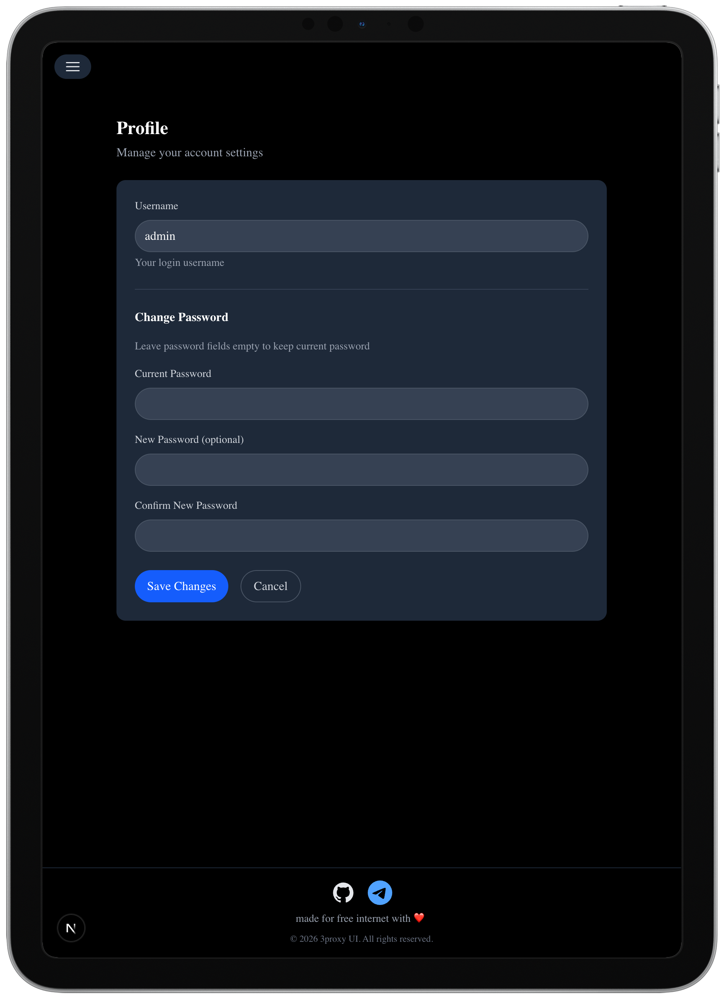 |

### iPhone 15 Pro Portrait (1179×2556)

| Home | Login | Dashboard |
|:---:|:---:|:---:|
| 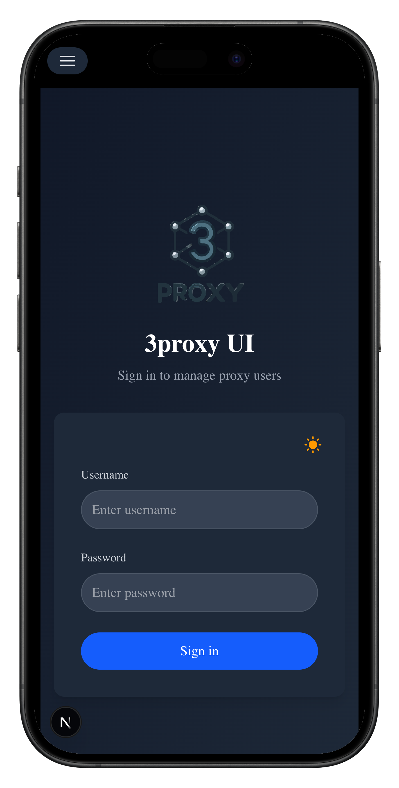 |  | 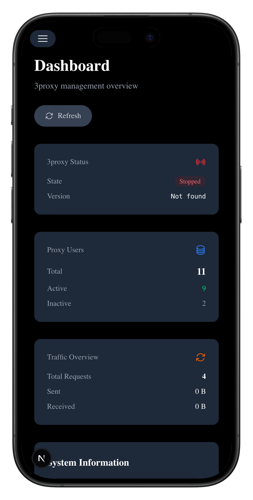 |

| Users List | Create User | Profile |
|:---:|:---:|:---:|
| 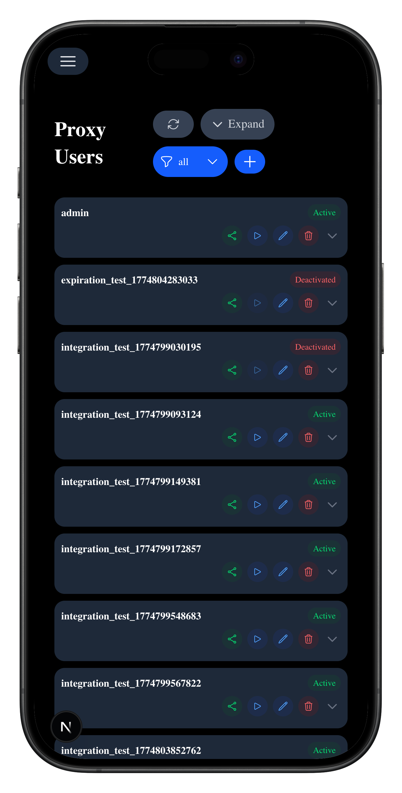 | 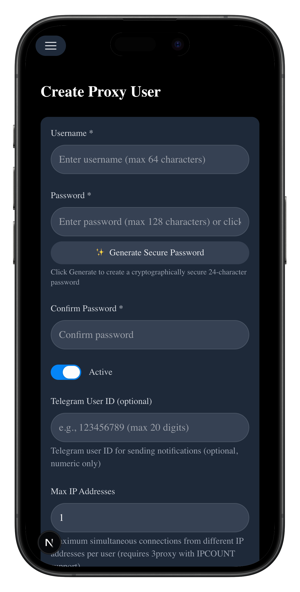 | 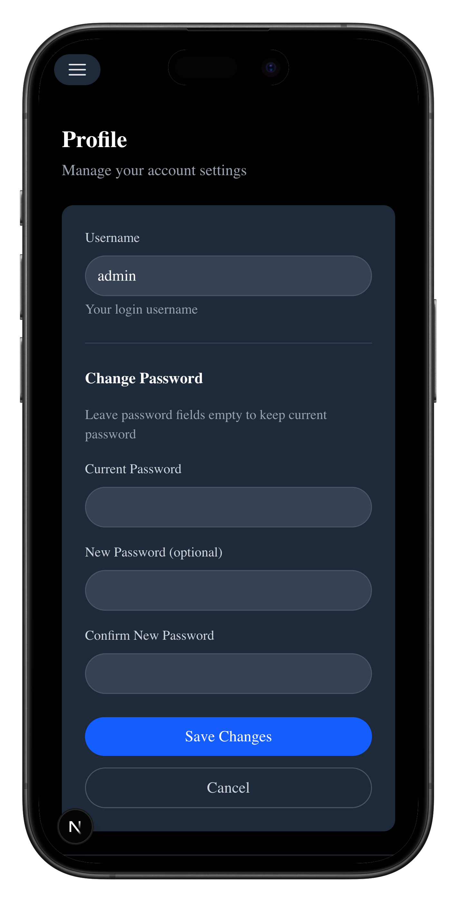 |

## Features

- **User Management**: Create, edit, and deactivate proxy users with data limits and expiration dates
- **Traffic Monitoring**: Real-time bandwidth usage tracking and analytics
- **Authentication System**: Secure login with JWT-based sessions and role-based access control
- **Configuration Management**: View and modify 3proxy settings through an intuitive interface
- **Telegram Integration**: Receive notifications for account deactivations and system events
- **Docker Support**: Easy deployment with Docker and Docker Compose
- **RESTful API**: Well-documented API for programmatic access and integration
- **Observability**: Built-in logging, metrics, and health checks
- **Responsive Design**: Works on desktop and mobile devices

## Technology Stack

### Frontend
- **Framework**: Next.js 16.2+ with React 19.1+
- **UI Library**: HeroUI for accessible, beautiful components
- **Styling**: Tailwind CSS 4.2+ with Tailwind Variants
- **Form Handling**: React Hook Form
- **Icons**: Lucide React
- **QR Code Generation**: QR Code Styling

### Backend
- **Runtime**: Node.js 20+ with TypeScript
- **ORM**: Prisma 6.19+ with SQLite
- **Authentication**: JWT (HS256) via jsonwebtoken, stored in an HttpOnly cookie
- **Password Hashing**: Bcrypt for panel accounts, Unix `crypt` for 3proxy proxy accounts
- **Scheduling**: Node-cron for the recurring maintenance job
- **Validation**: Zod for server-side configuration validation
- **API Routes**: Next.js API routes for RESTful endpoints

### DevOps & Infrastructure
- **Containerization**: Docker with multi-architecture support (amd64, arm64), published as a single
  multi-arch manifest
- **CI/CD**: GitHub Actions for automated testing and deployment
- **Testing**: Jest (unit, integration and fail2ban config projects) plus an E2E suite that drives
  real traffic through 3proxy in Docker Compose
- **Code Quality**: ESLint with Prettier formatting
- **Type Safety**: TypeScript 5.6+ with strict mode
- **Build Tools**: TSX, TSC-Alias

## Architecture

```
3proxy-ui/
├── src/
│   ├── app/              # Next.js app router
│   │   ├── api/          # API routes (auth, users, config, logs, etc.)
│   │   ├── admin/        # Admin dashboard and user management
│   │   ├── login/        # Authentication pages
│   │   └── ...           # Other pages
│   ├── components/       # Reusable UI components
│   │   ├── modals/       # Dialog components
│   │   └── users-list/   # User table and actions
│   ├── core/             # Session, config, logging, scheduler, system info
│   │   └── actions/      # Server actions (admin, config)
│   ├── hooks/            # Custom React hooks
│   ├── lib/              # Parsers and integrations (traffic, logs, Telegram)
│   ├── prisma/           # Prisma client instance
│   ├── styles/           # Global styles and fonts
│   ├── types/            # Shared TypeScript types
│   └── proxy.ts          # Next.js middleware
├── 3proxy/               # 3proxy configs, logs and the .proxyauth file
├── data/                 # Runtime data (traffic sync state, SQLite database)
├── prisma/               # Prisma schema and migrations
├── public/               # Static assets
├── scripts/              # Build, setup, start and maintenance scripts
└── tests/                # Jest projects (unit, integration, fail2ban) and E2E suites
```

## Quick Start

### Prerequisites
- Node.js 20.x or later
- Docker and Docker Compose (for containerized deployment)
- Git

A database is not required for local development: Prisma uses SQLite, and the schema is applied with
a migration.

### Development Setup

1. **Clone the repository**
   ```bash
   git clone https://github.com/aekozhevnikov/3proxy-ui.git
   cd 3proxy-ui
   ```

2. **Install dependencies**
   ```bash
   npm install
   ```

3. **Set up environment variables**
   ```bash
   cp .env.example .env
   # Edit .env with your configuration
   ```

4. **Initialize the database and the admin account**
   ```bash
   npx prisma migrate deploy
   npx prisma generate
   npm run compile   # `npm run setup` runs the compiled script
   npm run setup
   ```

5. **Start the development server**
   ```bash
   npm run dev
   ```

6. **Access the application**
   Open http://localhost:3000 in your browser

### Docker Deployment

The image ships the panel, fail2ban and the Docker CLI — but **not** 3proxy itself. The panel is a
control plane for a separate 3proxy instance, so a working deployment needs both containers sharing
a config volume, plus the Docker socket for configuration reloads. The compose file in this
repository wires that together:

```bash
cp .env.example .env   # set JWT_SECRET, at least 32 characters
docker compose up -d
```

The full reference, including every environment variable, is in **[DOCKER.md](DOCKER.md)**.

Running the panel on its own works for a first look, but it needs the 3proxy log volume or fail2ban
has nothing to watch:
```bash
docker run -d \
  --name 3proxy-ui \
  -p 3000:3000 \
  -e JWT_SECRET="your-secret-at-least-32-characters-long" \
  -e PROXY_DOMAIN="proxy.example.com" \
  -e LOGS_DIR=/etc/3proxy/logs \
  -e PROXYAUTH_PATH=/etc/3proxy/users/.proxyauth \
  -v 3proxy-data:/app/data \
  -v ./3proxy:/etc/3proxy \
  aekozh/3proxy-ui:latest
```

The published image is a multi-arch manifest and runs natively on both `linux/amd64` and
`linux/arm64` — no emulation involved.

**Default credentials** (change immediately after first login):
- Username: `admin`
- Password: `admin`

## Configuration

### Environment Variables
Copy `.env.example` to `.env` and adjust the following key variables:

| Variable | Description | Default |
|----------|-------------|---------|
| `DATABASE_URL` | SQLite connection string | `file:/app/data/app.db` in the image, set by the entrypoint |
| `JWT_SECRET` | HS256 signing key for session cookies, minimum 32 characters | (required) |
| `APP_URL` | Public base URL of the panel | `http://localhost:3000` |
| `APP_NAME` | Panel title | `3proxy UI` |
| `APP_DESCRIPTION` | Panel description | `Admin panel for 3proxy` |
| `TELEGRAM_BOT_TOKEN` | Telegram bot token for notifications | (optional) |
| `LOGS_DIR` | Directory containing 3proxy logs | `./3proxy/logs` |
| `PROXYAUTH_PATH` | Path to the 3proxy `.proxyauth` file | `./3proxy/users/.proxyauth` |
| `TRAFFIC_SYNC_INTERVAL` | Cron schedule for the maintenance job | `*/30 * * * *` (every 30 minutes) |
| `SYNC_INFO_FILE` | Where per-inode log offsets are stored | `./data/traffic-sync.json` |
| `LOG_LEVEL` | Application log verbosity: `debug`, `info`, `warn`, `error` | `info` |
| `ENABLE_FAIL2BAN` | Start fail2ban in the container | `true` |
| `ADMIN_USERNAME` / `ADMIN_PASSWORD` | Seeded on first start if no admin exists | `admin` / `admin` |

The proxy ports are baked in at build time from `HTTP_PORT` (3128), `SOCKS_PORT` (1080) and
`PROXY_DOMAIN`, and exposed to the browser through the matching `NEXT_PUBLIC_*` variables.

### 3proxy Integration
The UI expects a running 3proxy instance with:
- JSON logging enabled, so traffic can be derived from the log
- A `.proxyauth` file for user authentication
- Access to log files for traffic analysis

In a container, the 3proxy config directory has to be shared with the panel, and the paths have to
be pointed at explicitly. The panel reads `LOGS_DIR` and `PROXYAUTH_PATH`, which default to
`/app/3proxy/logs` and `/app/3proxy/users/.proxyauth` — a directory the image does not ship, so
without those variables traffic accounting silently reads nothing. The Docker socket is needed as
well, because reloading the configuration restarts the 3proxy container through the Docker API.

Traffic is accounted by reading new log entries incrementally and persisting a byte offset per
file, so repeated syncs do not double-count.

See the [3proxy documentation](https://3proxy.org/) for server setup instructions.

## API Endpoints

### Authentication
- `POST /api/auth/login` - User login
- `POST /api/auth/logout` - User logout
- `POST /api/auth/change-credentials` - Change password
- `GET /api/auth/session` - Check session status

### User Management
- `GET /api/admin/users` - List all users
- `GET /api/admin/users/[id]` - Get a single user
- `PUT /api/admin/users/[id]` - Update a user
- `DELETE /api/admin/users/[id]` - Delete a user
- `POST /api/admin/users/test-proxy` - Check proxy reachability
- `POST /api/users/maintenance` - Run traffic sync and maintenance

### System & Monitoring
- `GET /api/system/status` - Get system status (3proxy, users, logs)
- `GET /api/config/status` - Get the current 3proxy configuration
- `GET /api/config/generate` - Render the generated user configuration as JSON
- `POST /api/config/generate` - Write the generated user configuration to `PROXYAUTH_PATH`
- `POST /api/config/reload` - Restart the 3proxy container through the Docker API
- `GET /api/proxy-config` - Get proxy configuration
- `GET /api/logs` - Get recent log entries
- `GET /api/users/traffic` - Get user traffic statistics
- `GET /api/health` - Health check endpoint

### Background Jobs
A single recurring job is scheduled by `startBackgroundTasks()` in `src/core/scheduler.ts`. It runs
traffic synchronization and cleanup on the `TRAFFIC_SYNC_INTERVAL` cron schedule, and once at
startup. The same work is exposed on demand through `POST /api/users/maintenance`.

## Database Schema

The application uses Prisma ORM with SQLite and the following models:

- **User**: Panel accounts, with an `isAdmin` flag
- **Server**: Known 3proxy servers, their address, port and optional management API credentials
- **ProxyUser**: Proxy credentials, data limits, used traffic, IP limit, expiry and deactivation state
- **ConfigVersion**: Revision history of the generated 3proxy configuration

Traffic counters are stored as `BigInt` and mapped to `data_used`, in megabytes.

Run `npx prisma studio` to visualize and manage the database.

## Testing

### Unit Tests
```bash
npm run test:unit
```

### Integration Tests
```bash
npm run test:integration
```

### Fail2ban Configuration Tests
```bash
npm run test:fail2ban
```

### E2E Tests
The E2E suite builds the image and runs it through `docker-compose.dev.yml`, driving real traffic
through 3proxy:
```bash
npm run test:e2e
npm run test:e2e:traffic   # traffic limit assertions
npm run test:e2e:fail2ban  # fail2ban blocking assertions
```

### All Tests
```bash
npm run test:all
```

### Test Coverage
The project includes:
- Unit tests for utility functions and API routes
- Integration tests that run against a real migrated SQLite database
- E2E tests covering traffic accounting and fail2ban blocking

## Deployment

The deployment shapes are documented once, in **[DOCKER.md](DOCKER.md)**, and kept in sync with the
two compose files in this repository:

- `docker-compose.yml` — the reference stack: 3proxy plus the panel
- `docker-compose.dev.yml` — the same stack on a different port, used by the E2E suite
- `tests/e2e/docker-compose.e2e.yml` and `tests/e2e/docker-compose.fail2ban.yml` — E2E variants

To build the image locally:
```bash
docker build -t 3proxy-ui .
```

## Observability

### Logging
- Application logs go to the container output, with verbosity controlled by `LOG_LEVEL`
- The maintenance runner uses its own helper that adds a `success` level for job summaries
- 3proxy logs are read from `LOGS_DIR`, not written by the panel

### Metrics
- Built-in metrics collection for:
  - API response times
  - Database query performance
  - Background job execution
  - User authentication events
- Exportable via Prometheus (work in progress)

### Health Checks
- `/api/health` - Liveness and readiness probes
- `/api/system/status` - 3proxy process, user counts and log status
- Database connectivity checks
- Disk space monitoring

## Security Features

- **Authentication**: HS256 JWT in an HttpOnly cookie, verified against a fixed audience and issuer
- **Authorization**: Admin flag on the panel `User` model
- **Input Validation**: Server-side validation with Zod
- **Password Security**: Bcrypt for panel accounts; 3proxy proxy accounts are stored as Unix
  `crypt` hashes, because that is the format 3proxy's `.proxyauth` file requires
- **Session Management**: Session cookies expire after one hour and are cleared on logout and
  password change
- **Environment Secrets**: Sensitive data stored in environment variables
- **Brute-force Protection**: Optional fail2ban jails for the proxy ports

Note that the Docker socket is mounted read-write so that configuration reloads can restart the
3proxy container. That is equivalent to root on the host, so the panel should sit behind
authentication and ideally a TLS-terminating reverse proxy.

## Contributing

1. Fork the repository
2. Create your feature branch (`git checkout -b feature/amazing-feature`)
3. Commit your changes (`git commit -m 'Add some amazing feature'`)
4. Push to the branch (`git push origin feature/amazing-feature`)
5. Open a Pull Request

## License

This project is licensed under the MIT License - see the [LICENSE](LICENSE) file for details.

## Acknowledgments

- [3proxy](https://github.com/3proxy/3proxy) - The powerful proxy server being managed
- [HeroUI](https://heroui.com/) - Beautiful, accessible UI components
- [Next.js](https://nextjs.org/) - The React framework for production
- [Prisma](https://www.prisma.io/) - Modern ORM for Node.js and TypeScript
- [Tailwind CSS](https://tailwindcss.com/) - Utility-first CSS framework
- All contributors and users of this project

## Support

For issues, questions, or feature requests:
1. Check the [existing issues](https://github.com/aekozhevnikov/3proxy-ui/issues)
2. Open a new issue with detailed information

## Roadmap

Planned features for future releases:
- [ ] Real-time WebSocket dashboard for live traffic monitoring
- [ ] Advanced analytics and reporting
- [ ] LDAP/Active Directory integration
- [ ] SAML/OAuth2 authentication providers
- [ ] Automated backup and restore functionality
- [ ] Multi-tenancy support
- [ ] Plugin architecture for extensibility
- [ ] Enhanced observability with Grafana dashboards
- [ ] Automated SSL certificate management (Let's Encrypt)
